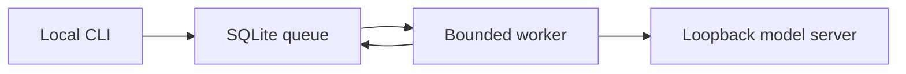

# GBE Edge Agent v0.1

A single-machine agent worker with a durable SQLite queue and an optional local model. It makes bounded text responses; it has no shell, file-editing, network browsing, or self-update authority. It can run disconnected from the internet after a compatible model and runtime are installed locally.

## Architecture and contract

`add` validates a 1–4000 character prompt and a caller-supplied 1–128 character idempotency key. It returns `{id,state}`. `once` atomically claims one due task, calls an OpenAI-compatible loopback `/v1/chat/completions` endpoint, and persists the answer. `status` returns job IDs, states, attempt counts, results, and errors as JSON. SQLite WAL provides restart persistence; expired two-minute leases recover crashed jobs. Three attempts maximum, with bounded backoff; exhausted jobs become `failed`. Duplicate keys return the original job. One worker process is recommended for v0.1. The model response is untrusted content, never executable instructions.



## Run (Python 3.10+; standard library only)

In the repository root, start a compatible local inference server separately, with a GPU-enabled model if your device supports one. Configure its model name and local endpoint. For example, if it serves OpenAI-compatible chat completions at port 8080:

```bash
python gbe_edge_agent/agent.py --db edge.sqlite3 add 'Explain why GPU memory matters' --key demo-1
python gbe_edge_agent/agent.py --db edge.sqlite3 --endpoint http://127.0.0.1:8080/v1 --model YOUR_LOADED_MODEL once
python gbe_edge_agent/agent.py --db edge.sqlite3 status
python -m unittest discover -s gbe_edge_agent -v
```

On Windows use `py -3` instead of `python` if needed. A failed or absent model server yields a queued retry, not a fabricated answer. To stop, do not run `once` again; no background service is installed. Preserve `edge.sqlite3` for restart, or back it up with SQLite's online backup API. Only run the CLI locally with trusted users who can access its database. No cloud account or GPU is required for the queue; **model inference requires a separately installed model server**. A GPU model does not guarantee intelligence or correctness.

## Verification and next gates

| ID | Observable requirement | Component | Check | Current result |
|---|---|---|---|---|
| E01 | Duplicate request returns one job | `enqueue` | `test_idempotency_and_restart` | Passed on Linux |
| E02 | Job survives process restart | SQLite WAL | `test_idempotency_and_restart` | Passed on Linux |
| E03 | Expired worker lease recovers | `claim` | `test_recover_expired_lease` | Passed on Linux |
| E04 | Inference failures stop after three attempts | `work_once` | `test_retry_is_bounded` | Passed on Linux |
| E05 | Actual GPU model answers tasks | local model runtime | Target hardware test | Pending: select board, memory, runtime and model |
| E06 | Runs after reboot with measured availability | host service | Device soak and reboot test | Pending: target device and service setup |

Target device, GPU memory, power budget, model license, measured accuracy, throughput, and hardware watchdog are undecided. No claim of permanent uptime, superintelligence, or superiority to cloud services is made. For a reliable field deployment, add device-specific service supervision, thermal and power monitoring, backup power, encrypted storage, signed updates with rollback, and an independent evaluation set before promotion.
